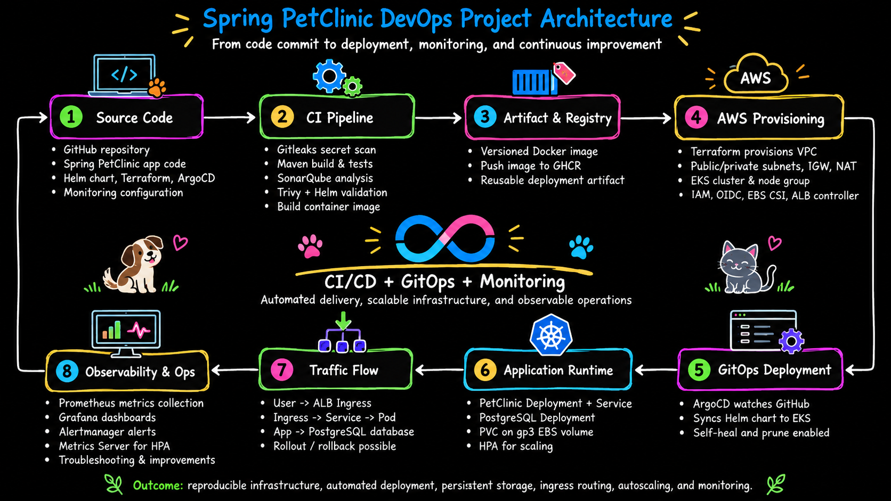

# Spring PetClinic DevOps Platform on AWS EKS

End-to-end DevOps implementation of Spring PetClinic using AWS, Terraform, Kubernetes, Helm, GitHub Actions, Argo CD, Prometheus, Grafana, and Alertmanager.

This project demonstrates infrastructure provisioning, CI/CD, GitOps-based deployments, persistent storage, autoscaling, monitoring, alerting, and troubleshooting on Amazon EKS.

---

## Architecture



---

## Tech Stack

### Cloud
- AWS
- Amazon EKS
- Amazon VPC
- Amazon EBS
- Application Load Balancer
- IAM
- NAT Gateway
- Internet Gateway

### Infrastructure as Code
- Terraform

### Containers and Kubernetes
- Docker
- Kubernetes
- Helm
- AWS Load Balancer Controller
- EBS CSI Driver
- EKS Pod Identity

### CI/CD and GitOps
- GitHub Actions
- GitHub Container Registry
- Argo CD

### Security and Quality
- Gitleaks
- Trivy
- SonarQube

### Monitoring
- Prometheus
- Grafana
- Alertmanager
- Metrics Server
- kube-state-metrics
- node-exporter

### Application
- Spring Boot
- Java 17
- Maven
- PostgreSQL 18

---

## Project Flow

```text
Developer
   |
   v
GitHub Repository
   |
   v
GitHub Actions
   |
   +--> Maven Build and Test
   +--> Gitleaks
   +--> SonarQube
   +--> Trivy
   +--> Helm Validation
   |
   v
Docker Image
   |
   v
GitHub Container Registry
   |
   v
Update Helm Image SHA
   |
   v
Git Repository
   |
   v
Argo CD
   |
   v
Amazon EKS
```

After a successful CI pipeline:

1. The application is built and tested.
2. Security scans are executed.
3. A Docker image is built and pushed to GHCR using the Git commit SHA.
4. The Helm image tag is updated in Git.
5. Argo CD detects the desired-state change.
6. Argo CD deploys the new version to Amazon EKS.

---

## Infrastructure

Terraform provisions the AWS infrastructure required by the platform.

```text
terraform/
├── main.tf
├── moved.tf
├── providers.tf
├── variables.tf
└── modules/
    ├── network/
    ├── iam/
    ├── eks/
    └── eks-addons-iam/
```

### Networking

The platform uses a custom VPC:

```text
VPC: 10.0.0.0/16

Public:
10.0.1.0/24
10.0.2.0/24

Private:
10.0.11.0/24
10.0.12.0/24
```

EKS worker nodes run in private subnets. A NAT Gateway provides outbound access for private workloads, while public resources such as the Application Load Balancer use public subnets.

---

## Amazon EKS

Terraform provisions:

- EKS cluster
- Managed node group
- IAM roles
- OIDC provider
- EKS Pod Identity integration
- EBS CSI Driver IAM configuration
- AWS Load Balancer Controller IAM configuration

Worker node configuration:

```text
Instance Type: c7i-flex.large
Desired Nodes: 2
Minimum Nodes: 1
Maximum Nodes: 3
```

---

## Kubernetes Application Architecture

The application is deployed using Helm.

```text
helm/petclinic/
├── Chart.yaml
├── values.yaml
└── templates/
    ├── configmap.yml
    ├── db.yml
    ├── hpa.yml
    ├── ingress.yml
    ├── networkpolicy.yml
    ├── petclinic.yml
    ├── pvc.yml
    ├── secrets.yml
    └── storageclass.yml
```

Traffic flow:

```text
Internet
   |
   v
AWS Application Load Balancer
   |
   v
Kubernetes Ingress
   |
   v
PetClinic Service
   |
   v
PetClinic Pods
   |
   v
demo-db Service
   |
   v
PostgreSQL Pod
   |
   v
PersistentVolumeClaim
   |
   v
Amazon EBS gp3
```

---

## Persistent Storage

PostgreSQL uses Amazon EBS-backed persistent storage.

```text
StorageClass: gp3
Provisioner: ebs.csi.aws.com
```

The EBS CSI Driver dynamically provisions the volume. EKS Pod Identity provides the AWS permissions required by the CSI controller.

---

## Application Startup and Health

PetClinic depends on PostgreSQL. An init container waits for the database before Spring Boot starts.

```text
PostgreSQL unavailable
        |
        v
Init container waits
        |
        v
PostgreSQL reachable
        |
        v
Spring Boot starts
```

The application uses:

- Startup Probe
- Readiness Probe
- Liveness Probe

Health endpoints:

```text
/livez
/readyz
```

---

## Horizontal Pod Autoscaling

The application uses an HPA:

```text
Minimum Replicas: 1
Maximum Replicas: 3
CPU Target: 70%
```

Metrics Server provides the Kubernetes Resource Metrics API used by the HPA.

---

## Network Security

A Kubernetes NetworkPolicy restricts access to PostgreSQL.

Only PetClinic application pods are allowed to connect to:

```text
TCP 5432
```

---

## GitOps with Argo CD

Argo CD continuously reconciles the Helm-based desired state from Git.

```text
Git change
   |
   v
Argo CD detects desired state
   |
   v
Compare Git vs cluster
   |
   v
Synchronize resources
```

Configured features:

- Automated synchronization
- Self-healing
- Resource pruning
- Namespace creation

Application definition:

```text
argocd/petclinic-application.yml
```

---

## CI/CD Pipeline

GitHub Actions performs:

```text
Checkout
   |
   v
Gitleaks
   |
   v
Maven Build and Test
   |
   v
SonarQube Analysis
   |
   v
Trivy Filesystem Scan
   |
   v
Helm Validation
   |
   v
Docker Build
   |
   v
Trivy Image Scan
   |
   v
Push Image to GHCR
   |
   v
Update Helm Image SHA
   |
   v
Commit to Git
   |
   v
Argo CD Deployment
```

Container images are published to:

```text
ghcr.io/tunisterk/spring-petclinic:<commit-sha>
```

Immutable Git commit SHA tags are used instead of `latest`.

---

## Monitoring and Observability

The project uses `kube-prometheus-stack`.

Components include:

- Prometheus
- Grafana
- Alertmanager
- kube-state-metrics
- node-exporter

Metrics Server is also installed for autoscaling metrics.

Monitoring configuration:

```text
monitoring/
├── values.yaml
└── install-monitoring.sh
```

### Grafana Dashboard

The custom dashboard monitors:

- PetClinic running pods
- PostgreSQL running pods
- PetClinic CPU usage
- CPU usage as percentage of request
- PetClinic memory usage
- Container restart count
- HPA current replicas
- HPA desired replicas

### Alerting

Custom Prometheus rules include:

```text
PetClinicDown
PostgreSQLDown
PetClinicHighCPU
PetClinicHighMemory
```

Alert conditions include:

```text
PetClinic unavailable for 2 minutes
PostgreSQL unavailable for 2 minutes
PetClinic CPU above 70% for 5 minutes
PetClinic memory above 80% for 5 minutes
```

Alert flow:

```text
Prometheus
   |
   v
Alert Rule
   |
   v
Pending
   |
   v
Firing
   |
   v
Alertmanager
```

The alerting path was tested end to end.

### Monitoring Installation

```bash
./monitoring/install-monitoring.sh
```

The script installs:

- kube-prometheus-stack
- Metrics Server

It uses `helm upgrade --install` to keep installation repeatable.

---

## Repository Structure

```text
.
├── .github/
│   └── workflows/
├── argocd/
│   └── petclinic-application.yml
├── docs/
│   ├── architecture.png
│   └── screenshots/
├── helm/
│   └── petclinic/
├── monitoring/
│   ├── install-monitoring.sh
│   └── values.yaml
├── terraform/
│   ├── modules/
│   ├── main.tf
│   ├── moved.tf
│   ├── providers.tf
│   └── variables.tf
├── src/
├── Dockerfile
├── pom.xml
├── README.md
└── TROUBLESHOOTING.md
```

---

## Deployment Overview

### 1. Provision Infrastructure

```bash
cd terraform
terraform init
terraform plan
terraform apply
```

### 2. Configure kubectl

```bash
aws eks update-kubeconfig \
  --region eu-central-1 \
  --name petclinic-cluster
```

Verify:

```bash
kubectl get nodes
```

### 3. Install Cluster Components

The EBS CSI Driver and Pod Identity related AWS infrastructure are managed through Terraform.

The AWS Load Balancer Controller is installed using Helm.

### 4. Deploy with Argo CD

```bash
kubectl apply -f argocd/petclinic-application.yml
```

Argo CD then deploys the Helm chart.

### 5. Install Monitoring

```bash
./monitoring/install-monitoring.sh
```

---

## Troubleshooting Experience

This project involved real troubleshooting during implementation and cluster recreation, including:

- EBS CSI Driver credential failures
- Missing EKS Pod Identity Agent
- PVC stuck in Pending state
- Missing gp3 StorageClass
- Argo CD following an older Git revision
- PostgreSQL 18 storage path changes
- Spring Boot liveness probe failures
- Application/database startup race conditions
- Missing Metrics Server after cluster recreation
- AWS Load Balancer Controller startup issues
- Local DNS resolution issues with the ALB hostname
- Terraform destroy blocked by controller-created AWS resources
- Manually installed cluster components disappearing after recreation

Detailed troubleshooting is documented in:

```text
TROUBLESHOOTING.md
```

---

## Key DevOps Concepts Demonstrated

- Infrastructure as Code
- AWS networking
- Amazon EKS
- Kubernetes
- Docker
- Persistent storage
- IAM
- EKS Pod Identity
- Kubernetes health probes
- Horizontal Pod Autoscaling
- Helm
- GitOps
- Argo CD
- CI/CD
- Immutable image tagging
- Prometheus monitoring
- Grafana dashboards
- Alertmanager
- DevSecOps scanning
- Infrastructure troubleshooting

---

## Security Notes

This repository is a learning and portfolio environment.

Some choices are intentionally simplified for lab use. For example, the Grafana administrator password is currently stored in the Helm values file.

In production, secrets should be managed using a dedicated secret-management solution.

---

## Future Improvements

Possible future enhancements:

- Remote Terraform state
- Automated platform bootstrap
- External Secrets / AWS Secrets Manager
- Advanced Alertmanager notification routing
- Centralized log aggregation
- Multiple environments
- Additional integration testing

These are intentionally outside the current project scope.

---

## Purpose

The goal of this project is to demonstrate an end-to-end DevOps workflow rather than only deploying an application.

It combines:

```text
Infrastructure
+
Application Deployment
+
CI/CD
+
GitOps
+
Security
+
Storage
+
Monitoring
+
Troubleshooting
```

into one AWS EKS platform.
